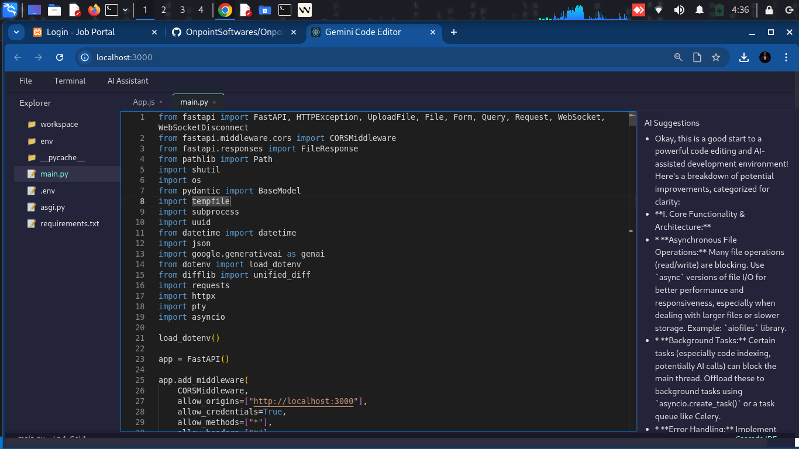

# Gemini Code Editor

[](https://github.com/OnpointSoftwares/OnpointIDE/blob/main/LICENSE)
[](https://github.com/OnpointSoftwares/OnpointIDE/stargazers)
[](https://github.com/OnpointSoftwares/OnpointIDE/issues)
[](https://github.com/OnpointSoftwares/OnpointIDE/pulls)
[](https://github.com/OnpointSoftwares/OnpointIDE/commits/main)

A modern, AI-powered web-based code editor built with React and Monaco Editor, featuring Gemini AI integration for intelligent code suggestions and reviews.

## 🖥️ Screenshot




## ✨ Features

- **Intelligent Code Editor**
  - Monaco Editor with syntax highlighting for multiple languages
  - Advanced code completion and IntelliSense
  - Real-time error detection and diagnostics

- **AI-Powered Assistance**
  - Gemini AI integration for code analysis
  - Smart code suggestions and improvements
  - Interactive diff viewer for AI-generated changes

- **Modern Development Experience**
  - Clean, responsive UI built with React and Bootstrap 5
  - Keyboard shortcuts for improved productivity
  - Terminal integration with xterm.js

## 🚀 Quick Start

### Prerequisites
- Node.js 16+ and npm 8+
- React 18+

### Installation

1. Clone the repository:
   ```bash
   git clone https://github.com/OnpointSoftwares/OnpointIDE.git
   cd OnpointIDE/frontend
   ```

2. Install dependencies:
   ```bash
   npm install
   ```

3. Start the development server:
   ```bash
   npm start
   ```
   The application will be available at `http://localhost:3000`

## 🏗️ Project Structure

```
src/
├── App.js              # Main application component
├── CodeEditor.js       # Monaco Editor integration
├── SuggestionsPanel.js # AI suggestions interface
├── api.js             # API service layer
└── StatusBar.js       # Status bar component
```

## 🤝 Contributing

Contributions are welcome! Please read our [contributing guidelines](CONTRIBUTING.md) to get started.

1. Fork the repository
2. Create your feature branch (`git checkout -b feature/AmazingFeature`)
3. Commit your changes (`git commit -m 'Add some AmazingFeature'`)
4. Push to the branch (`git push origin feature/AmazingFeature`)
5. Open a Pull Request

## 📄 License

This project is licensed under the MIT License - see the [LICENSE](LICENSE) file for details.

## 📬 Contact

For feature requests and bug reports, please open an issue on [GitHub](https://github.com/OnpointSoftwares/OnpointIDE/issues).

## 📊 Repository Stats


